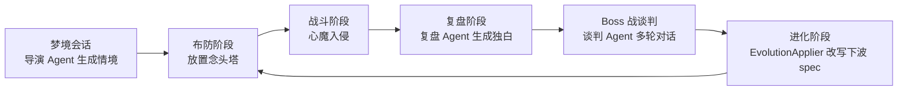

# 《认知围城 / Cognitive Siege》Game Design Document

> 版本 0.1 · MVP · 2026-05 · 项目负责人 / 主策

---

## 一、产品定位

### 1.1 核心一句话

> 在意识深处布防，对抗一群越打越聪明、还会跟你谈判的心魔——一场把心理治疗变成塔防博弈的"认知围城"。

### 1.2 一句话玩法

玩家扮演**认知工程师**，进入一名失眠者「林晚」的潜意识，在连续 10 晚的梦境会话中放置 6 种「念头塔」抵御 5 种**人格化心魔**的入侵。每晚对应 1 波战斗；每波结束，由 LLM 扮演的"刚战败的心魔集体意识"会**真实复盘**这一波，并在下一波**真的按这个新思路调整路径、编队、技能与阵容**。

### 1.3 目标受众

- 喜欢塔防 / 自走棋 / 肉鸽题材的核心玩家（Steam 销量带）
- 对叙事 / 心理 / 治愈题材敏感的二次元 / 文艺向玩家
- 行业内：游戏策划 / AI 游戏研发同行

### 1.4 平台

- 首发：Web（Phaser 3 + TypeScript），通过 GitHub Pages 静态托管
- 后续：可移植到 Unity（多平台发行）

### 1.5 项目背景

本项目作为「AI Agent 在游戏设计中的应用」作品集 MVP：


| 维度    | 认知围城       |
| ----- | ---------- |
| 题材    | 心理认知治疗（虚构） |
| AI 角色 | 心魔入侵者      |
| AI 玩法 | 入侵者自适应复盘进化 |
| 视觉    | 超现实紫调梦境    |


---

## 二、世界观与叙事

### 2.1 设定

近未来。一种名为 **「梦境会话」(Oneiric Session)** 的认知治疗技术允许治疗师以"工程师"身份进入患者的潜意识层。
潜意识里所有挥之不去的念头——焦虑、抑郁、强迫、自责、PTSD——都已经具象化为有名字、有性格、会说话的"心魔"。

### 2.2 主角

**林晚**（女性，28 岁，新媒体编辑）。
她最近三个月每晚只能睡 3 小时。她说："我不是不想睡，我是怕一闭上眼，那些想法就排队来找我。"
玩家不直接扮演林晚，而是扮演她聘请的认知工程师——你的塔，是从林晚自己的回忆与价值观中提取的"念头"。

### 2.3 心魔的"伦理"

游戏明确表态：心魔**不是恶魔**，是**人格化的负面思维**。它们的对白会让玩家共情；最终关谈判时，玩家可以选择**共情、对峙、欺骗**三种态度，对应不同结局。
设计意图：让玩家明白"治愈"不等于"消灭"，而是**与之共存、整合**。

### 2.4 免责声明（强制贴片）

> 本作为虚构作品，并不替代任何真实心理治疗。所有「心魔」均为人格化的叙事象征。如果你正在经历真实的心理困扰，请寻求专业帮助。

---

## 三、核心循环




每个完整循环 = 1 晚 = 1 波 = 90~120 秒。MVP 共 10 晚 / 10 波，讲述林晚连续十晚的潜意识防线变化。

---

## 四、玩法系统

### 4.1 资源系统


| 资源       | 来源                           | 用途                                 | 上限                      |
| -------- | ---------------------------- | ---------------------------------- | ----------------------- |
| 念力       | 击杀心魔掉落 / 关卡奖励 / 起始 60（随难度微调） | 建塔 / 升级 / 换阵                       | 无                       |
| 理智值（SAN） | 每次新开局按当前难度上限回满（普通 100）       | 心魔到达核心扣除 / Boss 核心压迫持续扣除 / 自我接纳塔回复 | 简单 120 / 普通 100 / 严苛 80 |


**幻觉机制**：当 SAN < 30%，每 1.5 秒进行一次幻觉判定。某座塔被选中后短时间内会变为红色 `!?` 状态，**随机攻击目标**或**短暂停火**。这是设计上对"心理崩溃边缘"的玩法表达。

**Boss 核心压迫**：普通心魔抵达自我核心后一次性扣 SAN 并消失；Boss 抵达核心后不会立刻离场，而是停在核心处每 0.9 秒持续扣除 SAN，直到被击杀或 SAN 归零。SAN 为 0 立即失败。

**Boss 全场技能**：Boss 出场后，战斗顶部会出现持续技能横幅，明确告知当前光环、狂暴强化和定时召唤内容。

- 第 5 波「焦虑之核」：全场心魔 +10% 移速；若谈判进入 `confront` 狂暴状态，额外使全场心魔 +20% 核心/路障攻击力；每 5 秒在 Boss 当前位置召唤 1 只焦虑·疾走者。
- 第 10 波「执念」：全场心魔获得 +10% 最大生命护盾；若进入 `confront` 狂暴状态，额外获得全场 20% 减伤；每 5 秒在 Boss 当前位置召唤 1 只抑郁·重雾。

### 4.2 念头塔（6 种）


| 塔     | 角色      | 攻击          | 范围  | 射速    | 念力  | 关键词                  |
| ----- | ------- | ----------- | --- | ----- | --- | -------------------- |
| 美好回忆塔 | AOE     | 14（范围 36px） | 110 | 0.9   | 30  | 克制密集                 |
| 信念塔   | 单体      | 48          | 160 | 0.55  | 50  | 克制高血                 |
| 共鸣塔   | 减速+揭穿   | 6（多目标）      | 130 | 1.4   | 40  | 唯一克制伪装               |
| 自我接纳塔 | 支援      | 0           | —   | —     | 60  | 缓慢回复 SAN，稳定后期但不能抹平压力 |
| 洞察塔   | 当前生命百分比 | 当前生命 18%    | 145 | 0.72  | 70  | 无固定伤害，克制厚血量          |
| 边界桩   | 路线肉盾    | 0           | 路线格 | 耐久 75 | 60  | 只能种在路线，短暂阻挡至死亡       |


当前 6 种塔对应 6 个明确策划职能：美好回忆塔处理密集低血心魔；信念塔处理高血单体；共鸣塔负责减速、反隐和多目标控制；自我接纳塔把防守压力转化为 SAN 回复；洞察塔按当前生命百分比造成伤害，用来反制后期厚血和 Boss；边界桩只能部署在路线格上，用耐久换取短时间阻挡。

塔可点击打开管理面板：升级到 LV3 会提升伤害、射程、射速并改变外观；拆除会返还 70% 累计投入念力。这个系统让玩家在复盘策略改变后可以主动换阵，而不是被一次布防锁死。

**索敌规则**：攻击塔会先过滤射程内且可见的心魔，然后按威胁分选目标。`taunt` 嘲讽单位硬优先；没有嘲讽时，护盾、Boss、抑郁/焦虑等前排单位权重更高，同类目标再比较路径进度。这保证前排/嘲讽心魔能真正吸引火力，而不是塔永远只打最靠近核心的脆皮单位。

### 4.3 心魔（5 种）


| 心魔     | HP / 速度 / 伤害 | 行为标签              | 设计意图          |
| ------ | ------------ | ----------------- | ------------- |
| 焦虑·疾走者 | 28 / 78 / 4  | rush（速度极快）        | 教学波，AOE 测试    |
| 抑郁·重雾  | 90 / 28 / 8  | aura（近旁塔射速 -40%）  | 信念塔单体专武       |
| 强迫·循环者 | 50 / 50 / 5  | loop（倒退一格并触发强迫复读） | 持续 DPS 与优先级验证 |
| 自责·伪装者 | 36 / 44 / 6  | cloak（未配置共鸣塔则隐形）  | 强制玩家配置共鸣塔     |
| 创伤·闪回  | 70 / 36 / 10 | flicker（受伤瞬间向前闪现） | 反爆发塔机制        |


每种心魔在数据层 (`personas.ts`) 有 4+ 个独立的「人格档案」（名字 / 动机 / 出场台词 / 死亡台词），spawn 时随机抽取，为复盘 Agent 提供叙事素材。

强迫·循环者的普通形态会在回头时向半径约 3 格内的同伴释放短时加速；Boss 形态不再回头，保持向核心推进，避免 Boss 行为读起来像寻路错误。

**技能 tag 视觉反馈**：

- `taunt`：头顶显示黄色 `!` 标记，并优先吸引塔火力。
- `stealth`：未被共鸣塔揭穿前处于半透明隐身状态，普通塔无法命中。
- `shield`：提高生命，并在索敌中更像前排。

### 4.4 路线、塑形与地图

地图采用格子制，但路线不是固定单线。每波会开放 2~3 条会合-分叉-再会合路线：

1. 入口共享一段主干，给玩家明确的第一接触区。
2. 中段分出短路、长绕、边路等路线，形成不同防守覆盖压力。
3. 终点前再次会合，保证核心前仍有最后防线。

复盘 Agent 的 `path_weight_shift` 不再是全员强制同路，而是路线主权重：约 70% 的心魔服从复盘倾向，约 20% 按心魔种类偏好分路，约 10% 在开放路线中随机扰动。这样既让复盘策略真实生效，也让同一波出现分路压力，并保留"不同心魔喜欢不同路线"的个性。

**塑形系统**：塑形改为念力购买，不再每波固定发放次数。布防阶段点击 `塑形` 或按 `S` 后，可以消耗念力把普通阻塞格改造成可建造格。限制如下：

- 不能改路径、入口、自我核心、边框或已有塔位。
- 不能直接改造仍有念力残堆的格子，必须先让塔打破残堆。
- 玩家开垦的格子会随下一波地图重投影保留，只要该格没有被新路线占用。
- 设计目标是让玩家在“买塔 / 升塔 / 买塑形”之间做经济取舍，而不是每波固定得到地图编辑次数。

**地图经济障碍物**：阻塞区会生成“念力残堆”。防御塔在射程内没有心魔目标时会攻击残堆；残堆被打破后返还念力。这个系统参考《保卫萝卜》的可破坏障碍物：玩家可以为了长期经济，牺牲短期火力空窗去清理地图资源。

### 4.5 关卡（10 晚 / 10 波）


| 波次  | 主题                 | 设计目标              |
| --- | ------------------ | ----------------- |
| 1   | 焦虑入门               | 教学：塔放置、念力使用       |
| 2   | 抑郁登场               | 教学：信念塔的需要性        |
| 3   | 强迫切入               | 教学：DPS 与节奏        |
| 4   | 自责伪装               | 教学：共鸣塔强制需求        |
| 5   | **谈判 Boss · 焦虑之核** | 介绍谈判系统            |
| 6   | 创伤余震               | 介绍闪回机制，并固定开放三线压力  |
| 7   | 创伤追击               | LLM 可正常使用创伤参与后期压迫 |
| 8   | 混合压力               | 综合考验              |
| 9   | 决战前夜               | 数量爆发              |
| 10  | **终极 Boss · 执念**   | 三选一结局             |


---

## 五、AI Agent 设计（核心创新）

### 5.1 复盘 Agent（最重要）

#### 输入

```json
{
  "wave": 5,
  "outcome": "cleared",
  "sanityAfter": 62,
  "sanityDelta": -18,
  "deathsByTower": { "memory": 4, "belief": 2, "resonance": 1 },
  "perKind": {
    "anxiety": { "spawned": 6, "killed": 6, "leaked": 0, "avgProgress": 0.41 },
    "guilt":   { "spawned": 3, "killed": 1, "leaked": 2, "avgProgress": 0.83 }
  },
  "towerLayout": { "memory": 2, "belief": 1, "resonance": 0, "acceptance": 1 },
  "sampleLines": [
    { "kind": "guilt", "persona": "微笑面具", "killedBy": "reached_core", "progress": 1 }
  ]
}
```

#### System Prompt（节选）

> 你是一只刚刚战败的"心魔"集体意识，正在与同伴们复盘这一波的失败。
> 用第一人称（"我们"或"我"）写一段 ≤ 90 字的中文复盘独白，文学化、有情绪、戏剧化，避免说教。
> 严格输出一个 JSON 对象，包含 monologue / lesson / next_strategy。

#### 输出契约

```json
{
  "monologue": "玩家可见的中文独白",
  "lesson": ["≤12字简短启示", "≤3 条"],
  "next_strategy": {
    "path_weight_shift": "short | long | edge | center | random",
    "skill_priority": ["stealth", "swarm", "rush", "split", "taunt", "shield"],
    "formation": "scattered | clustered | wedge | rear_first",
    "aggression": -1.0,
    "preferred_kinds": ["anxiety", "depression", "obsession", "guilt", "ptsd"]
  }
}
```

#### EvolutionApplier 的对应关系


| LLM 输出字段            | 引擎真实改变                                                                                                           |
| ------------------- | ---------------------------------------------------------------------------------------------------------------- |
| `path_weight_shift` | 重写每只 spawn 的 `pathBias`，战斗中作为具体路线的主权重：约 70% 服从策略、约 20% 按心魔偏好、约 10% 随机；`random` 为逐个心魔随机选路，`center` 当前等价于短快主干的正面强突 |
| `formation`         | 在阵容替换和增援后重排 spawn delay：`scattered=均匀`，`clustered=3 只一波`，`wedge=加速`，`rear_first=前排屏障后接后排压力`                      |
| `skill_priority`    | 60% 非 boss spawn 追加技能 tag，影响速度 / 隐身 / 护盾 / 嘲讽索敌                                                                  |
| `aggression`        | 数值映射到 hp×(1+0.2a) / speed×(1+0.15a) / delay×(1-0.3a)，并参与后期增援数量                                                   |
| `preferred_kinds`   | 稳定替换 ~45% 非 boss spawn 的 kind，替换后再统一重排出怪时间                                                                       |
| 波次压力                | 后期按波数和 aggression 增加非 Boss 单位数量，避免心魔方只靠数值膨胀拉开差距                                                                  |
| 教学期安全阀              | 前 1-4 波限制 LLM 过早投放未教学心魔和高级技能：隐身最早第 4 波，护盾/嘲讽最早第 5 波，群体/分裂最早第 6 波                                                 |


> **关键设计点**：玩家在「心魔复盘」面板看到的 `next_strategy` 不是装饰文本，而是**真的会被翻译成下一波 spawn 表的代码改动**。复盘面板还会列出"已生效的下波变化"。当前版本会开放 2~3 条路线分支，并让 `path_weight_shift` 作为主要路线倾向参与逐个心魔的路线抽样；阵型重排发生在阵容变化之后，确保前排、嘲讽、护盾单位能按设计先进入火力区。

### 5.2 谈判 Agent

第 5、10 波 Boss 出场前，进入多轮文字谈判（默认 2 轮）。

- Boss 持有 `persona / description / kindHint`
- 玩家上一轮选择会作为 `lastPlayerTag` 传入下一轮，影响 Boss 措辞
- 玩家最终选择的标签 `{empathy, confront, deceive}` 会**累积**为 `NegotiationResolution`：


| Tag      | hpMul | speedMul | damageMul | 备注         |
| -------- | ----- | -------- | --------- | ---------- |
| empathy  | ×0.78 | —        | ×0.85     | Boss 攻防均下降 |
| confront | ×1.15 | ×1.10    | ×1.20     | Boss 全面狂暴  |
| deceive  | ×0.92 | ×0.92    | ×1.05     | 偶尔暴击但行动迟疑  |


最终 Boss 进战斗时的 hp / speed / damage 会按累积乘数应用。

### 5.3 导演 Agent（轻量）

每关开场，根据 `night` 与 `emotionHint` 生成 80~120 字第三人称情境 vignette，建立情感代入。

### 5.4 容错与降级（**演示稳定性核心**）

- LLM 缺失 / 超时 / JSON 解析失败 → `fallbackReview()`：根据"主导致敌塔"在本地 12 套预生成"心声库"中挑最匹配的
- `demoMode = true`（默认开启）→ 完全不发请求，全部走本地库
- 谈判 Agent 失败 → 回退到 `fallback.ts` 中预写好的 Boss 对白集
- 导演 Agent 失败 → 回退到 10 个预写情境

> **设计意图**：不填任何 API Key 也能完整体验全部叙事和系统反馈。

---

## 六、视觉与音效

### 6.1 美术方向

- **关键词**：超现实 / 紫调梦境 / 高对比格子 / 接近不透明的战术可读性
- 主色板：`#a78bfa`（薰衣草紫）、`#f472b6`（梦境粉）、`#67e8f9`（共鸣青）、`#fde68a`（回忆金）、`#0b0a18`（深夜底）
- 心魔、塔、地块与特效采用 `public/assets/art/` 中的位图资源，并保留 Unicode 符号作为资源缺失时的 fallback。
- 路径、塔位、阻塞格尽量接近不透明，避免紫色梦境效果牺牲战术识别。
- 塔底座使用小椭圆光圈，塔渲染深度按格子行号排序：下方塔会挡住上方塔，符合俯视塔防的视觉预期。
- 心魔死亡时粒子爆散；建塔 / 塑形时有短促光效；嘲讽心魔头顶显示黄色 `!` 标记。

### 6.2 音效

当前版本采用 **真实 WAV 资源 + WebAudio fallback** 的混合方案：

- `public/assets/audio/` 内置 10 个 WAV：建塔、塔射击、心魔受击、心魔死亡、SAN 受击、波次开始、复盘开启、选项点击、胜利、失败。
- 音效由 `scripts/generate-audio.mjs` 生成，使用 Node.js 内置 API 输出双声道 WAV，避免额外依赖；后续可替换为 Kenney Interface Sounds / UI Audio / Impact Sounds 等 CC0 素材。
- `AudioManager` 优先播放 Phaser 缓存音频；资源缺失或播放失败时自动回退到 Web Audio 合成，保证 Demo 不会因资源问题静音。
- 音色方向：柔和钟琴表现塔和 UI；短促空气感脉冲表现命中；低频下坠表现 SAN 受击；长尾和弦表现胜利 / 失败。
- 环境音仍由 Web Audio 生成：3 个轻微失谐的正弦波叠加成低频梦境垫底。

---

## 七、技术架构

### 7.1 技术栈


| 层   | 选择             | 原因                                                |
| --- | -------------- | ------------------------------------------------- |
| 引擎  | Phaser 3.80    | 2D 塔防成熟、轻量、Web 原生                                 |
| 语言  | TypeScript 5.4 | 严格类型 + IDE 提示，便于面试展示                              |
| 构建  | Vite 5         | 极快 HMR，零配置                                        |
| LLM | OpenAI 兼容      | 一份代码兼容 DeepSeek / 智谱 / Moonshot / Ollama / OpenAI |
| 部署  | GitHub Pages   | 免费、点链接即玩                                          |


### 7.2 模块划分

```
src/
├─ main.ts                         入口（启动 Phaser、Sound 解锁）
├─ types.ts                        共享类型契约
├─ settings.ts                     localStorage 持久化
├─ game/
│  ├─ data/                        静态数据：心魔/塔/人格/波次/Fallback 库
│  ├─ entities/                    Tower / Enemy 运行时实体
│  ├─ systems/                     Grid / WaveSystem / EvolutionApplier / BattleLog / Audio / AgentProof
│  ├─ llm/                         client + 三个 Agent
│  └─ scenes/                      Boot / Menu / Battle Phaser 场景
└─ ui/                             DOM 覆盖层（Settings / Review / Negotiation / Vignette / Help）
public/assets/art/                 塔、心魔、地块、特效等位图美术资源
public/assets/audio/               生成后的 WAV 音效资源
scripts/generate-audio.mjs          音效生成脚本
scripts/deploy-pages.mjs            GitHub Pages 静态部署辅助脚本
```

### 7.3 关键工程亮点

- **Agent 输入裁剪**：`reviewAgent.compactSummary()` 把潜在 30+ 条心魔战斗日志滚动成 6 条 sample + 聚合统计，确保 prompt 体积可控
- **JSON 严格校验**：`extractJson()` 处理 `json` 围栏 + 平衡括号扫描；`sanitize()` 双重校验所有 enum 值，超界/缺失自动 fallback
- **AbortController 友好**：所有 LLM 调用支持 signal，将来可加超时取消
- **统一游戏时间**：心魔移动、塔冷却、幻觉判定、Boss 核心压迫和 Phaser tween/timeScale 都挂在统一 `gameTime` 上，倍速不会造成单边计时错乱
- **稳定命中区**：Phaser 按钮统一使用独立 `Zone` 接管点击，避免容器 hitArea 在边缘角落漏判
- **音频双保险**：真实 WAV 音效提升听感，WebAudio fallback 保证资源缺失时仍可演示
- **地图重投影**：`Grid.createMapProjection()` 生成当前波的开放路线、阻塞格和可建造格；玩家塑形新增的塔位会作为 `extraBuildCells` 参与下一波投影；不再有效的念力残堆会随地图变化清理。
- **战术索敌**：`Tower.pickTarget()` 不再只按路径进度选最前心魔，而是把嘲讽、护盾、Boss、前排类型和路径进度合成威胁分。

---

## 八、商业化与可拓展性

### 8.1 当前 MVP 不含

- 多关卡 / 多患者
- 元进度（成就、解锁）
- 多语言
- 多人

---

## 九、风险与对策


| 风险            | 概率  | 对策                                              |
| ------------- | --- | ----------------------------------------------- |
| LLM 演示翻车 / 超时 | 中   | 默认 demoMode=true；预生成 fallback 库；用 setTimeout 包装 |
| 题材敏感          | 低   | 显式免责声明 + 治愈向叙事 + 不出现自我伤害描写                      |
| 玩法易上手难精通      | 中   | 前 4 波严格教学，第 5 波后才开放 LLM 进化                      |
| Web 音频解锁阻塞    | 低   | 首次 pointer/key 事件触发解锁                           |


---

## 附录 A：开发排期对照（实际）


| 阶段                | 计划     | 实际                                                                           |
| ----------------- | ------ | ---------------------------------------------------------------------------- |
| 项目骨架              | D1-2   | 数小时（受益于 Vite + Phaser 现成工具链）                                                 |
| 核心循环 + 6 塔 5 心魔   | D3-4   | 同步完成；后续补齐洞察塔、边界桩与第 5 类心魔                                                     |
| 双资源 + 幻觉          | D5     | 同步完成                                                                         |
| 人格化台词库            | D6     | 5×4 = 20 套预设                                                                 |
| 复盘 UI + Mock      | D7     | 同步完成                                                                         |
| 复盘 Agent 接入       | D8     | 同步完成（OpenAI 兼容）                                                              |
| Evolution Applier | D9     | 同步完成                                                                         |
| 谈判 Boss + 多轮对话    | D10    | 同步完成                                                                         |
| 导演 Agent + 设置页    | D11    | 同步完成                                                                         |
| 视觉打磨 + 音效         | D12    | 同步完成                                                                         |
| 体验迭代              | D13-16 | 塔升级/拆除、多路线网络、念力购买塑形、可破坏念力残堆、复盘优先路线、嘲讽索敌、BOSS 核心压迫、终局战斗统计 CSV、按钮命中区与 CODEX 更新 |


---

> 本 GDD 持续迭代，欢迎反馈。

